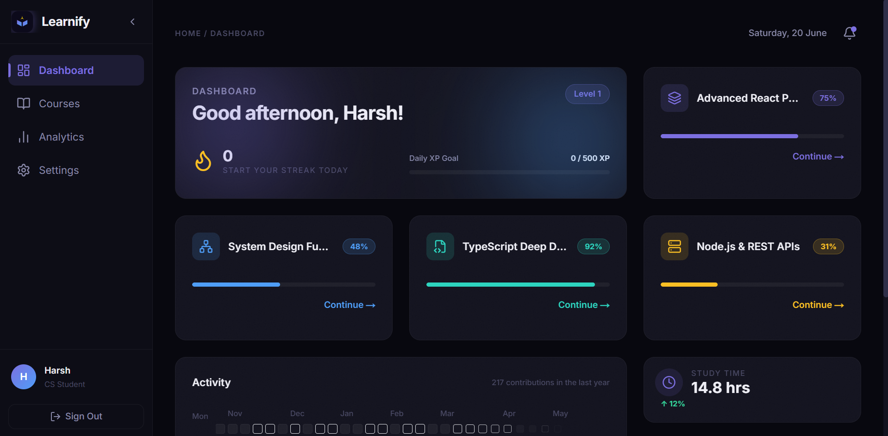
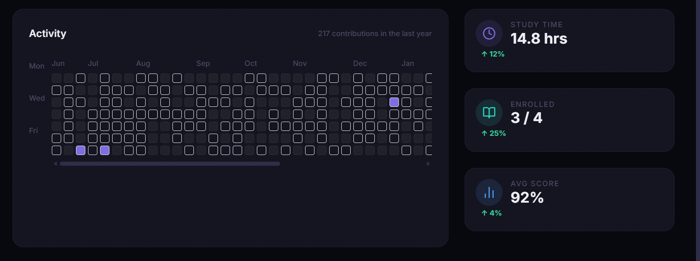
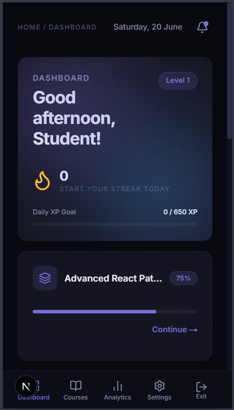
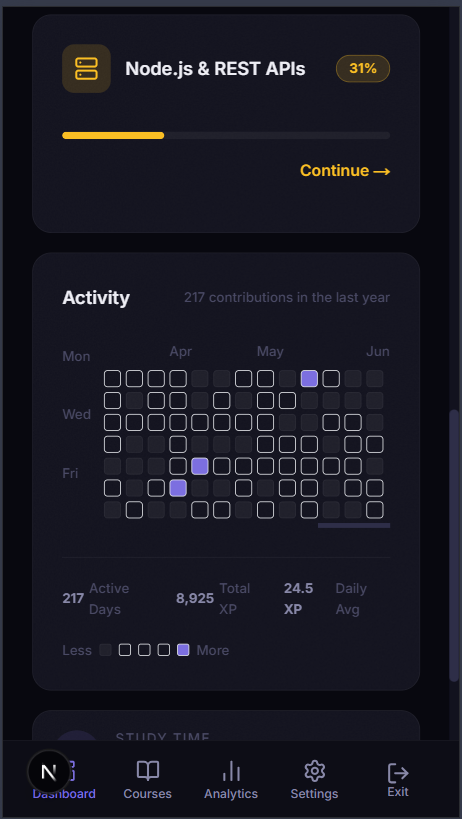

# Learnify — Student Learning Dashboard

A high-fidelity, production-quality student dashboard built for the Frontend Intern Challenge. Dark-mode only, fully animated, and backed by live Supabase data.

**Live Demo:** [Learnify](https://learnify-rosy.vercel.app)

---

## Tech Stack

| Tool | Purpose |
|------|---------|
| Next.js 15 (App Router) | Framework |
| Supabase | Auth + PostgreSQL database |
| Tailwind CSS | Styling |
| Framer Motion | Animations |
| Lucide React | Icons |
| TypeScript | Type safety |

---

## Features

### Core (Required)
- **Bento Grid Dashboard** — Hero tile, dynamic course tiles, activity graph, stats ribbon
- **Live Supabase Data** — Courses fetched via Server Components, filtered per authenticated user with RLS
- **Framer Motion Animations** — Staggered tile entrance, spring-physics hover, `layoutId` sidebar highlight, animated progress bars
- **Skeleton Loaders** — Suspense boundaries with shimmer skeletons while data fetches
- **Responsive Layout** — Full sidebar on desktop → icon-only on tablet → bottom nav on mobile
- **Collapsible Sidebar** — Smooth spring animation, tooltips in collapsed state

### Bonus (Added)
- **Full Auth Flow** — Email/password sign up & login via Supabase Auth, protected routes via middleware
- **Settings Page** — Edit display name, change password with strength meter, XP goal slider, danger zone
- **Coming Soon Pages** — Minimal typographic placeholder for unbuilt routes
- **1-Year Activity Grid** — 52-week horizontally scrollable contribution graph, auto-scrolls to current week
- **Password Strength Meter** — 4-segment real-time scorer (length, uppercase, number, special char)
- **Custom Learnify Logo** — SVG book+spark icon with purple→blue gradient

---

## Architecture

### Server / Client Component Split

```
app/dashboard/page.tsx        ← Server Component (async)
  │  fetches profile + passes to client tiles
  └── <Suspense fallback={<SkeletonTile />}>
        <CourseList />         ← Server Component (async, fetches courses)
          └── <CourseTile />   ← Client Component (Framer Motion)

components/sidebar/Sidebar.tsx ← Client Component (collapse state, usePathname)
components/tiles/HeroTile.tsx  ← Client Component (greeting, XP bar animation)
components/tiles/ActivityTile  ← Client Component (useMemo grid, scroll ref)
```

**Rule followed:** Data fetching happens only in Server Components. Framer Motion, `useState`, `useEffect`, and browser APIs live only in Client Components (`'use client'`).

### Data Flow

1. User signs up → Postgres trigger auto-creates a `profiles` row
2. `dashboard/page.tsx` calls `supabase.auth.getUser()` server-side
3. Fetches `profiles` row for greeting/streak/XP data
4. `CourseList` fetches `courses` filtered by `user_id` (RLS enforced at DB level too)
5. Data passed as props into client tiles — no client-side fetching

### Auth & Route Protection

- `middleware.ts` runs on every request, refreshes Supabase session cookie
- Unauthenticated users hitting `/dashboard` or `/settings` are redirected to `/auth/login`
- Logged-in users hitting `/auth/login` or `/auth/signup` are redirected to `/dashboard`
- Sign out uses a Server Action via `<form>` — works without JavaScript

### Animation Strategy (Zero Layout Shifts)

All animations use **only `transform` and `opacity`** — no animating `width`, `height`, `margin`, or `top/left` on visible content. The only exception is the progress bar fill, which animates `width` inside an `overflow: hidden` container so it cannot shift surrounding layout.

Spring physics used everywhere: `type: 'spring', stiffness: 300, damping: 20`.

---

## Database Schema

```sql
-- profiles (auto-created on signup via trigger)
id uuid · display_name text · streak int · xp_today int · xp_goal int · level int

-- courses (per-user, RLS enabled)
id uuid · user_id uuid · title text · progress int · icon_name text · color text
```

---

## Environment Variables

```bash
# .env.local
NEXT_PUBLIC_SUPABASE_URL=https://your-project.supabase.co
NEXT_PUBLIC_SUPABASE_ANON_KEY=your-anon-key
```

---

## Running Locally

```bash
git clone https://github.com/yourusername/learnify
cd learnify
npm install
cp .env.example .env.local   # fill in your Supabase credentials
npm run dev
```

Then run the SQL setup in your Supabase SQL editor (see `supabase/schema.sql`).

---

## Challenges

**Server/Client boundary with Framer Motion** — Framer Motion requires `'use client'` but data must be fetched in Server Components. Solved by fetching in server, passing serialized data as props to client tiles.

**Zero layout shifts with animations** — Skeleton tiles are given explicit `min-height` matching real tiles so no reflow occurs when Suspense resolves.

**Supabase SSR session management** — Used `@supabase/ssr` with cookie-based session refresh in middleware to keep auth state consistent across server and client renders.

---

## Preview






**Full Demo Video:** [Watch Demo Video](https://drive.google.com/file/d/1poGtNg5Zh8yROhT2STq2tB0ze--aIkel/view?usp=sharing)